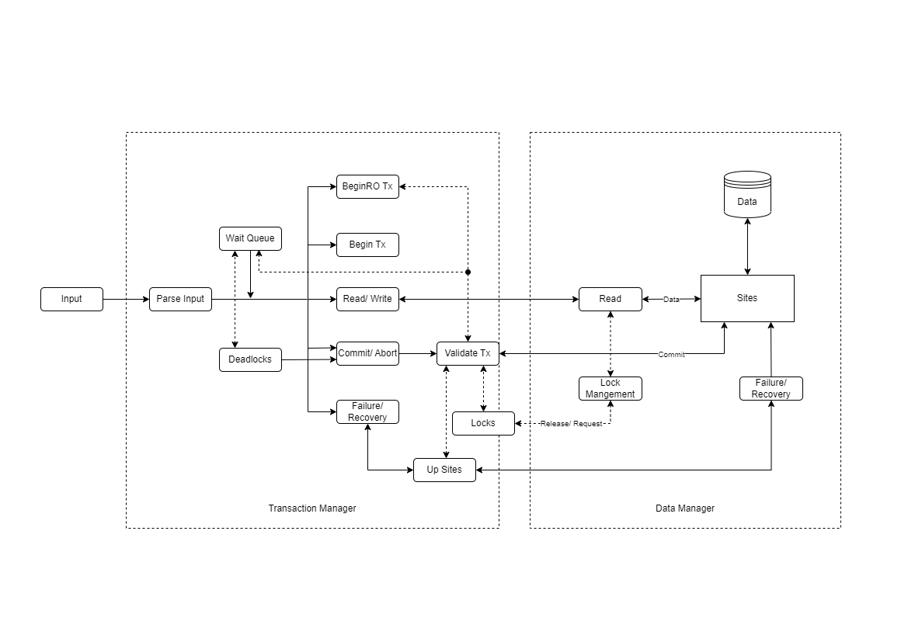

# Rep2Rec
Replicated Concurrency Control and Recovery

## Team Members
```angular2html
Deep Mehta: dnm7500
Sarvani Nadimnity: sn2884@nyu.edu
```

## Design Flow



## Framework Details

```python
class TransactionManager:
    """
        We treat transaction manager as the main function and acts as a middleware. 
        It takes case of I/O, parsing, communications, deadlock detection, 
        simulation of failure/ recovery, etc
        """
    
    def __init__(self):
        transaction_queue = {} # {"T1": Transaction(T1)}
        wait_queue = []        # [(tx, fn, *args, waiting_vars)]
        
    def input_parser(self, file_path): ...
        # Read the input file from file_path
        # Parse input line by line
        # Execute transactions and manage wait_queue

    def begin_transaction(self, tx): ...
        # Create a new transaction with id=tx
        
    def execute_read_write_transaction(self, tx, var, value=None): ...
        # Validate the sites
        # Request locks and validate
        # Call the corresponding function from TMHelper

    def end_transaction(self, tx): ...
        # Commit/ Abort transaction tx

    def deadlock_cycle(self): ...
        # Use DFS to find a cycle in the wait_queue
        # If a cycle is found, abort the youngest transaction
        # This happens every tick

    def fail(self, S): ...
        # Simulate failure in site S

    def recover(self, S): ...
        # Simulate recovery in site S
    
    def dump(self): ...
        # Print data from all sites
```
```python
class TMHelper:
    """ 
        It is a helper function for Transaction Manager
        We store the sites data and lock data here
    """
    
    def __init__(self):
        sites = []        # [S1, S2, ..., S10]
        up_sites = []     # [list_of_available_sites]
        RO_sites = {}     # {var: {S1, S2, ..., Sn}} - valid sites for var
        last_failure = {} # {S1: 4}
    
    def read(self, var, sites): ...
        # Attempt read from sites
        # Return first valid read

    def validate_and_commit(self, data): ...
        # Validate up_sites before committing
        # Validate the timestamps for each site up time
        # If validated, write each variable to all sites
    
    def write(self, sites, var, value): ...
        # Write {var: value} to sites
    
    def get_ro_cache(self): ...
        # Reads and returns all readable data for RO transaction

    def set_lock(self, sites, var, lock_type): ...
        # Verify lock availability and update lock status

    def read_lock_status(self, var): ...
        # Return current lock status for var

    def handle_failure(self, site): ...
        # Simulate failure on site
        # Update the necessary variables
    
    def handle_recovery(self, site): ...
        # Simulate recovery on site
        # Add site back to accessible sites (except replicated data until new write)
```
```python
class Transaction:
    """ 
        This provides the transaction object
        Each new Tx creates a new instance that is stored in TM
    """
    def __init__(self):
        id = id         # Tx
        data = {}       # All data related to Tx
        locks = {}      # List of locks on var, site
        start_time = 0  # Internal Counter

    def read(self, var=None): ...
        # Attempt read for var and return the data
        # Fetch data snapshot for RO_read
    
    def write(self, sites, var, value): ...
        # Update {var:value} within Tx memory

    def request_lock(self, sites, var, lock_type): ...
        # Request/ Promote a lock using TMHandler
        # Update lock dictionary accordingly

    def release_lock(self): ...
        # Release all locks on commit/ abort

    def commit(self): ...
        # Attempt commit on all data for Tx
        # Abort if validation fails
```
```python
class DataManager:
    """
        Individual Site instances
        These sites interact with the data storage (.txt files)
        The validations here are only a sanity check.
        Most validations are handled by TM
    """
    def __init__(self):
        id = id     # S1 -> 1
        data = {}   # Currently stored data (used for read)
        locks = {}  # Locks on all vars
        status = 1  # Up/ Down

    def read_data(self, var): ...
        # Return value if valid
    
    def write_data(self, var, value): ...
        # Write {var: value} to data storage if site is up

    def failure(self): ...
        # set status = 0
        # Flush all variables

    def recovery(self): ...
        # set status = 1
        # Recover un-replicated variables
```