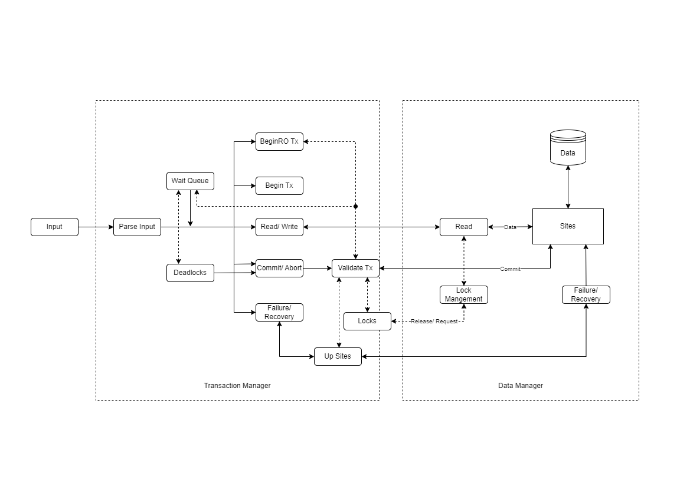

# Rep2Rec
Replicated Concurrency Control and Recovery

This repository is the final project for Advanced Database Systems - Prof. Shasha.

The repository attempts to mimic a Concurrent Database system with 
Multi-version read concurrency, lock management, site failure/ recovery and deadlocks.

## Team Members
```angular2html
Deep Mehta: dnm7500
Sarvani Nadimnity: sn2884@nyu.edu
```

## Design Flow



## ReproZip installation
```angular2html

```

## Running the code
```angular2html

```

## Sample test input

```angular2html
# mini_test.txt
// Test 1.
// T2 should abort, T1 should not, because of kill youngest

begin(T1)
begin(T2)
W(T1,x1,101)
W(T2,x2,202)
W(T1,x2,102)
W(T2,x1,201)
end(T1)
dump()
```

## Sample Output

```angular2html
1: Began transaction T1
2: Began transaction T2
3: Acquiring Write Lock Successful: T1: x1 - 101; Sites: [2]
3: Write Successful: T1: x1 - 101; Sites: [2]
4: Acquiring Write Lock Successful: T2: x2 - 202; Sites: [1, 2, 3, 4, 5, 6, 7, 8, 9, 10]
4: Write Successful: T2: x2 - 202; Sites: [1, 2, 3, 4, 5, 6, 7, 8, 9, 10]
5: Failed getting write locks at : T1: x2 - 102; Sites: [1, 2, 3, 4, 5, 6, 7, 8, 9, 10]
5: Attempting transaction from wait queue: T1 - execute_write_transaction(T1,x2,102)
5: Failed getting write locks at : T1: x2 - 102; Sites: [1, 2, 3, 4, 5, 6, 7, 8, 9, 10]
5: Wait queue traversed, continuing with new input
6: Failed getting write locks at : T2: x1 - 201; Sites: [2]
6: DEADLOCK FOUND: ['T1', 'T2']; Aborting transaction: T2
6: Released locks for Transaction T2 and variables 2 at sites [1, 2, 3, 4, 5, 6, 7, 8, 9, 10] 
6: Attempting transaction from wait queue: T1 - execute_write_transaction(T1,x2,102)
6: Acquiring Write Lock Successful: T1: x2 - 102; Sites: [1, 2, 3, 4, 5, 6, 7, 8, 9, 10]
6: Write Successful: T1: x2 - 102; Sites: [1, 2, 3, 4, 5, 6, 7, 8, 9, 10]
6: Wait queue traversed, continuing with new input
7: Committed Transaction T1
7: Released locks for Transaction T1 and variables 1 at sites [2] 
7: Released locks for Transaction T1 and variables 2 at sites [1, 2, 3, 4, 5, 6, 7, 8, 9, 10] 
8: Dump data
8: Site 1: 2: 102, 4: 40, 6: 60, 8: 80, 10: 100, 12: 120, 14: 140, 16: 160, 18: 180, 20: 200
8: Site 2: 1: 101, 2: 102, 4: 40, 6: 60, 8: 80, 10: 100, 11: 110, 12: 120, 14: 140, 16: 160, 18: 180, 20: 200
8: Site 3: 2: 102, 4: 40, 6: 60, 8: 80, 10: 100, 12: 120, 14: 140, 16: 160, 18: 180, 20: 200
8: Site 4: 2: 102, 3: 30, 4: 40, 6: 60, 8: 80, 10: 100, 12: 120, 13: 130, 14: 140, 16: 160, 18: 180, 20: 200
8: Site 5: 2: 102, 4: 40, 6: 60, 8: 80, 10: 100, 12: 120, 14: 140, 16: 160, 18: 180, 20: 200
8: Site 6: 2: 102, 4: 40, 5: 50, 6: 60, 8: 80, 10: 100, 12: 120, 14: 140, 15: 150, 16: 160, 18: 180, 20: 200
8: Site 7: 2: 102, 4: 40, 6: 60, 8: 80, 10: 100, 12: 120, 14: 140, 16: 160, 18: 180, 20: 200
8: Site 8: 2: 102, 4: 40, 6: 60, 7: 70, 8: 80, 10: 100, 12: 120, 14: 140, 16: 160, 17: 170, 18: 180, 20: 200
8: Site 9: 2: 102, 4: 40, 6: 60, 8: 80, 10: 100, 12: 120, 14: 140, 16: 160, 18: 180, 20: 200
8: Site 10: 2: 102, 4: 40, 6: 60, 8: 80, 9: 90, 10: 100, 12: 120, 14: 140, 16: 160, 18: 180, 19: 190, 20: 200
8: Done

Process finished with exit code 0

```

[Design Document](./Literature/Document.pdf)